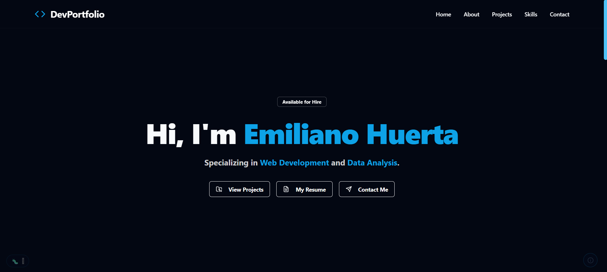

# DevPortfolio – Emiliano Huerta

A modern, professional portfolio website built with React, Vite, Tailwind CSS, and more. This site showcases my work, skills, and journey as a full-stack software engineer, with a focus on web development and data analysis. Explore my background, featured projects, and interactive UI—all in one place.

## 🚀 Live Preview

[View Portfolio Live](https://ehuerta6.github.io/DevPortfolio/)



---

## 📚 Site Sections

### Hero

- Eye-catching introduction with name, tagline, and call-to-action buttons.

### About

- Personal background, journey, and professional focus.
- Profile picture and summary of experience.

### Projects

- Featured project(s) with details, tech stack, and live demo links.
- Fancy details modal for in-depth project info.

### Skills

- Visual grid of web development and data analysis skills/tools.

### Contact

- Contact form and direct links to email, LinkedIn, and GitHub.

### Easter Eggs / Hidden Features

- Fun interactive surprises and secret sections (try catching the bug or finding the tech stack!).

---

## 🛠️ Tech Stack

- **React 18+**
- **Vite**
- **Tailwind CSS**
- **TypeScript**
- **ShadCN/UI**
- **Lucide Icons**

---

## ⚙️ Setup & Local Development

1. **Clone the repo:**
   ```bash
   git clone https://github.com/ehuerta6/website-portfolio.git
   cd website-portfolio
   ```
2. **Install dependencies:**
   ```bash
   npm install
   ```
3. **Start the dev server:**
   ```bash
   npm run dev
   ```
4. **Open [http://localhost:5173](http://localhost:5173) in your browser.**

---

## 🙏 Credits / Acknowledgements

- [ShadCN/UI](https://ui.shadcn.com/) for UI components
- [Lucide Icons](https://lucide.dev/)
- Inspiration from many open-source portfolios and the React community

---

## 📄 License

This project is licensed under the MIT License. See [LICENSE](./LICENSE) for details.
